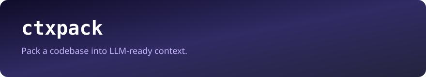

<p align="center">
  
</p>

<p align="center">
  <strong>Pack a codebase into LLM-ready context.</strong><br/>
  Respects <code>.gitignore</code>, budgets tokens, redacts secrets.
</p>

<p align="center">
  <a href="https://github.com/KodYazicam/ctxpack/actions"></a>
  
  
  
</p>

---

`ctxpack` walks a project, ranks the files that actually matter (README, package manifests, `src/`), and writes a single prompt you can paste into ChatGPT, Claude, Copilot, or any local model. It is a real CLI, not a wrapper around an API.

```bash
npx ctxpack . -o prompt.md
```

## Why it exists

Pasting a zip into a chat window dumps `node_modules`, lockfiles, and secrets. `ctxpack` does the boring part:

- skips gitignored and binary files
- estimates tokens and drops low-value files when you set a budget
- redacts AWS keys, GitHub tokens, OpenAI keys, Slack tokens, private keys
- emits **markdown**, **xml** (Anthropic-style), or **json**

## Install

```bash
npm install -g ctxpack
# or
npx ctxpack --help
```

## Usage

```bash
ctxpack [dir] [options]

  -o, --out <file>         Write to file (default: stdout)
  -m, --max-tokens <n>     Token budget (default: 80000)
  -f, --format <fmt>       markdown | xml | json
      --no-redact          Keep secrets (not recommended)
      --no-tree            Skip the repository tree
      --ignore <glob>      Extra ignore (repeatable)
      --include <glob>     Only include matching paths
```

```bash
# Small prompt for a chat model
ctxpack ./src --max-tokens 12000 -o chat.md

# XML blocks for Claude
ctxpack . --format xml -o claude.xml

# Library use
```

```ts
import { pack } from "ctxpack";

const result = pack({
  root: process.cwd(),
  maxTokens: 16_000,
  format: "markdown",
});
console.log(result.tokens, result.files.length);
```

## Output sample

````markdown
# Context pack

Generated by [ctxpack](https://github.com/KodYazicam/ctxpack) — KodYazicam.

## Repository tree

src
├── cli.ts
└── pack.ts

## src/pack.ts

```ts
export function pack(options: PackOptions): PackResult { ... }
```
````

## Library API

| Export | Purpose |
| --- | --- |
| `pack(options)` | Walk, rank, budget, render |
| `estimateTokens(text)` | Fast cl100k-ish estimate |
| `findSecrets(text)` / `redactSecrets(text)` | Secret scan |
| `walkFiles(options)` | Gitignore-aware walker |

## License — KYAL-1.0

Free to use, copy, modify, and ship. **Attribution is mandatory.**

Keep this credit in LICENSE, README, and any public product that embeds ctxpack:

```
Author : Batuhan (KodYazicam)
Project: ctxpack
Source : https://github.com/KodYazicam/ctxpack
```

See [LICENSE](./LICENSE).

<p align="center"><sub>Built by <a href="https://github.com/KodYazicam">KodYazicam</a></sub></p>
